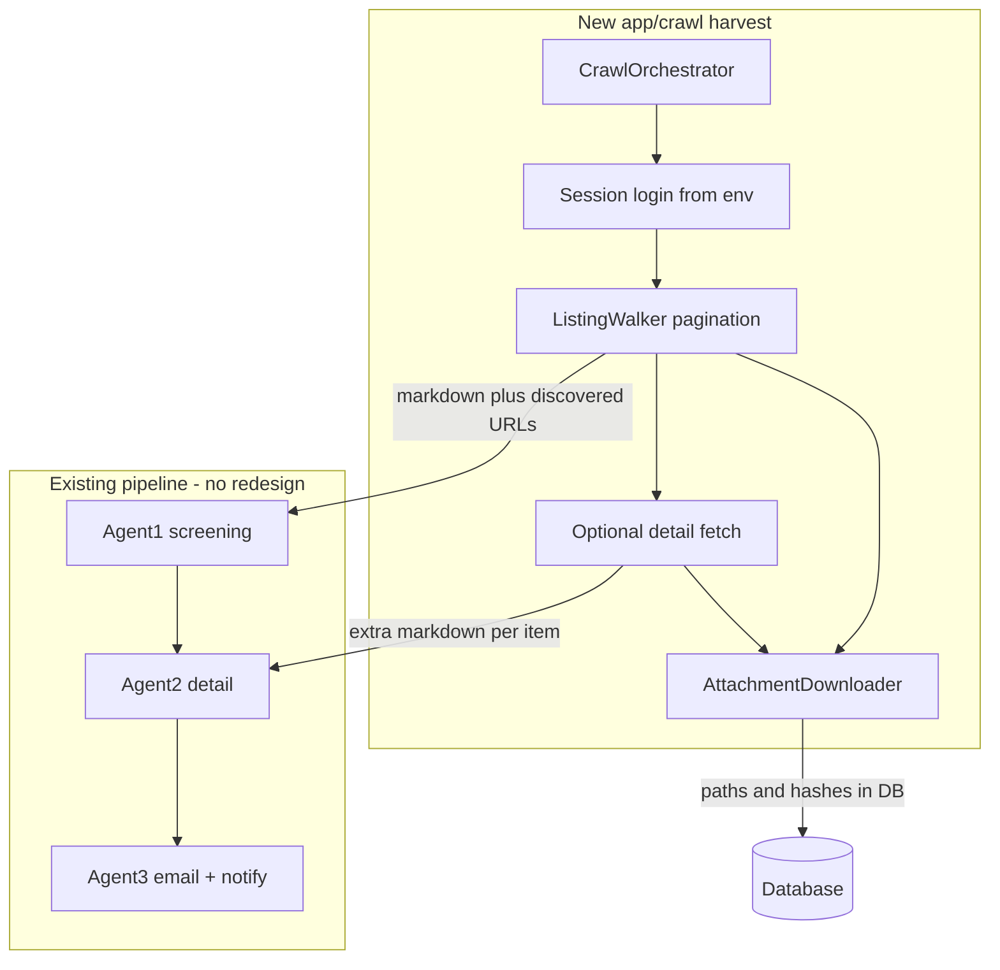

# Crawl agent: what we are building next

This document is the **single source of truth** for the **next major build** after the core screening pipeline (Agent1 → Agent2 → Agent3, email, dashboard) is in place.

**Related:** conceptual background in [crawling-auth-pagination-ideas.md](./crawling-auth-pagination-ideas.md) (auth profiles, pagination patterns, checkpoints). This spec turns that into **concrete code layout, phases, and integration**.

---

## 1. Problem statement

Today the system:

- Calls **crawl4ai** once per [`MonitoredPage`](../app/models/page.py) URL ([`app/services/scraper.py`](../app/services/scraper.py)).
- Pipes markdown into **Agent1** → **Agent2** → **Agent3** ([`app/services/scheduler.py`](../app/services/scheduler.py), [`app/agents/workflow.py`](../app/agents/workflow.py)).

**Gaps:**

1. No **form login** or reusable **authenticated session** for gated portals (credentials will live in `.env`, referenced by config).
2. No **pagination** (next page, query params, infinite scroll) when listing tenders.
3. No first-class **attachment download** and DB linkage.
4. **`crawl_frequency_hours`** exists on `MonitoredPage` but the scheduler uses only global **`CRAWL_INTERVAL_HOURS`** and processes every active page on every tick.

**Goal:** Add a **harvest layer** that can log in, walk listings (and optionally details), download files, then **feed the existing pipeline** unchanged so tenders still get classified, emailed, and logged.

---

## 1.1 Agreed approach: hybrid harvest (locked in)

**Team decision:** Use a **hybrid** system—**two backends behind one contract** (`HarvestResult`), not one tool for every URL.

| `crawl_strategy` (per source) | When to use | Backend |
|------------------------------|------------|---------|
| **`crawl4ai`** | Public listing/detail, **no** login, **no** multi-step UI (single fetch is enough) | Existing [`TenderScraper`](../app/services/scraper.py) (`AsyncWebCrawler`) |
| **`playwright`** | Login, cookie/session, **Next**, infinite scroll, attachment downloads, SPAs | [`app/crawl/`](../app/crawl/) (Playwright async) |
| **`hybrid`** (optional, Phase C+) | Same source needs **both** (e.g. Playwright for auth + listing navigation, then a lighter fetch for some child URLs) — define per adapter; **do not** guess—document the exact split in that source’s adapter or config. | Orchestrator composes steps |

**Rule:** Choose **`crawl4ai`** only when you are sure the page does not need a real browser session or clicks. When in doubt, use **`playwright`** for that source.

---

## 2. What we are building (scope)

| In scope | Out of scope (for later) |
|----------|---------------------------|
| New package `app/crawl/` with orchestrator, session, listing, attachments, types, optional `adapters/` | Full multi-tenant secret vault; start with `.env` + DB **keys** that name env vars |
| **Hybrid:** **crawl4ai** + **Playwright** behind one `HarvestResult`; per-source `crawl_strategy` | CAPTCHA solving automation |
| **Playwright (async)** for gated/interactive sources; **crawl4ai** for simple public URLs | “One config fits all portals” without occasional code adapters |
| Per-source or global tick: **respect `crawl_frequency_hours`** (and global interval as wake-up) | Redis queue / distributed workers (optional Phase E+) |
| **`HarvestResult`** contract feeding `TenderAgent.process_page` | Rewriting Agent1–3 logic |
| **Attachments** table + disk storage under e.g. `data/attachments/` | Virus scanning / DLP pipelines |
| Structured logging + optional debug artifact dumps | Full frontend rework |

---

## 3. Target data flow

**Rule:** Harvest code returns **markdown (and metadata)** compatible with what agents already expect. Classification, deduplication, email composition stay in `app/agents/`.

---

## 4. Package layout (`app/crawl/`)

All new crawl logic lives here so debugging stays in one tree. The scheduler imports a **small public API** (e.g. `harvest_for_page`).

**Dedicated agents folder:** Put each harvest “agent” (single responsibility) in **`app/crawl/agents/`** as **one Python module per agent**—no bundling unrelated behavior into one giant file. The **orchestrator** stays at `app/crawl/orchestrator.py` and only composes agents; it should stay thin.

| File / directory | Responsibility |
|------------------|----------------|
| `app/crawl/__init__.py` | Export public entrypoints only |
| `app/crawl/types.py` | `HarvestResult`, budgets, pagination snapshot types (`TypedDict` / dataclasses) |
| `app/crawl/orchestrator.py` | Compose agents for one `MonitoredPage`; budgets, timings, errors; **no** low-level Playwright in here |
| `app/crawl/agents/__init__.py` | Re-export agent classes if useful for tests |
| `app/crawl/agents/session_agent.py` | Session: Playwright context, login from env keys, cookie/session reuse for one run |
| `app/crawl/agents/listing_agent.py` | Listing: pagination / “next” / URL templates; markdown + link collection |
| `app/crawl/agents/attachment_agent.py` | Attachments: resolve download targets, fetch with session, hash + paths |
| `app/crawl/agents/detail_fetcher_agent.py` | Optional: per–detail-page fetch when listing alone is insufficient |
| `app/crawl/adapters/` | Optional per-portal overrides (`base.py` + `portal_xxx.py`) when DB config is not enough |
| `app/crawl/debug.py` | If `CRAWL_DEBUG_SAVE_DIR` (or similar) set: save HTML/screenshots per step; never log secrets |

Add **new** crawl-side agents only as **new files under `app/crawl/agents/`** (e.g. `planner_agent.py` only if truly needed), not under `app/agents/` (that package is LLM Agent1–3).

`app/services/scraper.py` remains the crawl4ai implementation; orchestrator calls it when `crawl_strategy` is `crawl4ai`.

### 4.1 Testing policy (required for every new agent)

- Mirror the package with **`tests/crawl/`**: **one test module per agent module**, e.g. `tests/crawl/test_session_agent.py` for `session_agent.py`.
- **Every new file in `app/crawl/agents/`** must ship in the **same change** as tests that cover its public behavior (happy path + at least one failure/edge case where relevant).
- Prefer **mocked Playwright** (or fakes) in unit tests so CI does not require a live browser for every run; optional **marked** integration tests can use real Playwright locally or in a dedicated job.
- The **orchestrator** gets `tests/crawl/test_orchestrator.py` (composition + strategy branching with mocks).
- Optional: `tests/crawl/conftest.py` for shared fixtures (fake page, fake context).

`scripts/crawl_harvest_smoke.py` (from § 9) remains a **manual / staging** supplement, not a substitute for pytest coverage.

---

## 5. `HarvestResult` (contract)

Normalized output from both crawl4ai and Playwright paths (exact field names can be refined in code):

- `status`: `success` | `failed`
- `error`: optional message (no secrets)
- `markdown`: main text for Agent1 (may concatenate multiple listing pages)
- `html`: optional, for debugging or Agent2
- `listing_urls` / `detail_urls`: discovered tender URLs
- `attachments`: list of `{ original_url, stored_path, sha256, bytes, mime_type? }`
- `session_meta`: e.g. phases completed, timings (for logs only)

The scheduler maps this into the existing `process_page(page_content=..., page_url=..., page_id=..., ...)`.

---

## 6. Configuration

### 6.1 Environment (`.env`)

- Named credentials per portal profile, e.g. `CRAWL_AUTH_PORTAL_A_USER`, `CRAWL_AUTH_PORTAL_A_PASSWORD`.
- Optional: login URL override, future cookie blob variable names.
- Operational: `CRAWL_INTERVAL_HOURS` (2 or 4 as needed), `ATTACHMENT_STORAGE_DIR`, `MAX_PAGES_PER_RUN`, `CRAWL_DEBUG_SAVE_DIR`.

**Never** print passwords or tokens in logs.

### 6.2 Database / API (evolve in Phase B)

Extend `monitored_pages` or add a linked **source profile** with:

- `crawl_strategy`: `crawl4ai` | `playwright` | `hybrid`
- Auth: `auth_type`, references to **env var names** (not values): `env_username_key`, `env_password_key`, `login_url`, `post_login_wait_ms`
- Pagination: `pagination_type`, `next_selector` or `page_param`, `max_pages_per_run`, `max_items_per_run`
- Later: checkpoint fields (`last_checkpoint_cursor`, `last_seen_published_at`)

---

## 7. Scheduler changes (`app/services/scheduler.py`)

1. **Eligibility:** Before processing a page, if `now - last_crawled < crawl_frequency_hours` (and `last_crawled` is set), **skip** unless manual trigger. Global `CRAWL_INTERVAL_HOURS` remains the loop period.
2. **Harvest branch (hybrid):**
   - `crawl_strategy=crawl4ai`: `TenderScraper.scrape_page(page.url)` → map to `HarvestResult`.
   - `crawl_strategy=playwright`: `app.crawl.orchestrator.harvest_for_page(...)` (session, pagination, attachments).
   - `crawl_strategy=hybrid`: orchestrator runs the **documented** multi-step flow for that source (see adapter/config); still ends with `HarvestResult`.

`CrawlLog` should reflect harvest phase failures distinctly from Agent1–3 failures where practical.

---

## 8. Attachments

- New table **`tender_attachments`** (or equivalent): `tender_id`, `original_url`, `stored_path`, `mime_type`, `sha256`, `fetched_at`, `bytes`.
- Files on disk: e.g. `data/attachments/{tender_id}/` (gitignored), with total size limits per run.
- Optional follow-up: pass attachment summaries into Agent3 prompts.

---

## 9. Debug and operations

- **Structured logs:** `page_id`, `crawl_strategy`, `phase`, `duration_ms`.
- **Optional dumps:** on failure, save HTML to `CRAWL_DEBUG_SAVE_DIR` for offline inspection.
- **Script:** `scripts/crawl_harvest_smoke.py --page-id N` calling the same orchestrator entry as production (reproduce without running FastAPI).

---

## 10. Implementation phases (order of work)

1. **Phase A — Scheduling truth:** Honor `crawl_frequency_hours` with global tick; test with multiple pages on different cadences.
2. **Phase B — Source profile schema:** Migration + repositories + API fields for strategy, auth keys, pagination.
3. **Phase C — Scaffold + Playwright path:** `app/crawl/` package, `HarvestResult`, one **pilot** portal (login + 2–3 listing pages → Agent1).
4. **Phase D — Attachments:** download + DB + minimal API for listing files.
5. **Phase E — Scale:** checkpoints, backoff, MFA/manual session playbook, caps on concurrent details.

**First coding step:** **Phase A** + **`app/crawl/` scaffold**: `types.py`, `orchestrator.py` stub (delegating to `TenderScraper` for `crawl4ai`), and **`app/crawl/agents/`** package with **stub modules + matching `tests/crawl/` tests** so CI pins import paths and the “one agent = one file = one test file” rule is established from day one.

---

## 11. Documentation after implementation

Under `docs/` (separate from `ideas/`):

- `crawl-agent-overview.md`
- `crawl-agent-architecture.md` (includes `app/crawl/` file map)
- `crawl-source-configuration.md`
- `crawl-operations-runbook.md`
- `crawl-implementation-phases.md`

Link from [crawling-auth-pagination-ideas.md](./crawling-auth-pagination-ideas.md) to this spec and eventually to `docs/`.

---

## 12. Risks and principles

- Many portals need a **small code adapter** in `app/crawl/adapters/` even with rich DB config.
- Operators must confirm **terms of use** and rate limits per source.
- MVP secrets in `.env` are acceptable internally; production multi-tenant needs stronger secret storage.

---

## 13. Success criteria

- At least one **authenticated** source runs on a **2h or 4h** effective cadence, pagination collects listings, new rows appear in `tenders`, pipeline completes through **email**, `crawl_logs` show a coherent story.
- Attachments stored and queryable for that pilot.
- New crawl **agent** modules under `app/crawl/agents/` ship with **pytest** coverage in `tests/crawl/` in the same change.
- New team members can orient using this file + `docs/crawl-*.md` once written.

---

## 14. What not to do (common mistakes)

Use this as a checklist so production and local debugging stay safe and maintainable.

| Do **not** | Why |
|-------------|-----|
| Use **crawl4ai** for sites that need **login**, **Next**, or **downloads** behind a session | You will get empty pages, wrong content, or flakiness; use **Playwright** (or a documented **hybrid** flow) for that source. |
| Put **credentials or API keys in the repo** or in DB as plaintext values | Use `.env` and DB fields that store **names of env vars**, not secret values. |
| **Log** passwords, tokens, cookie blobs, or full auth responses | Audit leakage; logs should use `page_id`, `phase`, and **redacted** errors only. |
| Spawn **Playwright** from random places (scheduler, agents, routes) | Centralize in **`app/crawl/`** so traces, timeouts, and session lifecycle are one place. |
| Feed **raw HTML** into Agent1 without a defined path to **markdown/text** | Keep a consistent **`HarvestResult.markdown`** contract so Agent1 prompts stay stable. |
| Add **LLM “planner”** for every click before trying selectors | Expensive, brittle; use explicit selectors + adapters; LLM only as last resort per site. |
| Crawl **without caps** (`max_pages_per_run`, `max_items_per_run`) | Runaway pagination can block the worker and hammer the source (ToS / IP ban). |
| Store attachments **outside** a defined root (e.g. `data/attachments/`) or without **hash/size** | Hard to dedupe, migrate, or debug disk growth. |
| Change **Agent1–3** behavior to “fix” bad scrape output | Fix **harvest** first; agents should stay dumb to transport details. |
| Rely on **one global interval** while ignoring **`crawl_frequency_hours`** | Over-crawls some pages and starves others; align with Phase A of this spec. |
| Add a **new** module under `app/crawl/agents/` **without** tests in **`tests/crawl/`** | Regressions go unnoticed; each agent file requires a matching `test_*` module (see § 4.1). |

---

*Last aligned with internal plan: **hybrid** crawl4ai + Playwright, `app/crawl/agents/` (one file per agent), **`tests/crawl/`** required per agent, scheduling, attachments, phased rollout.*
